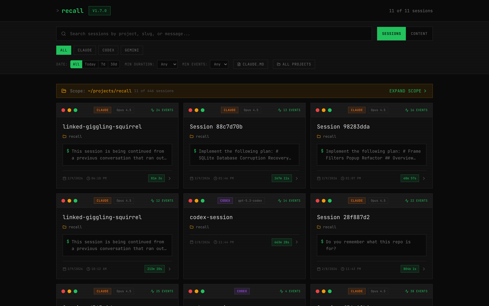
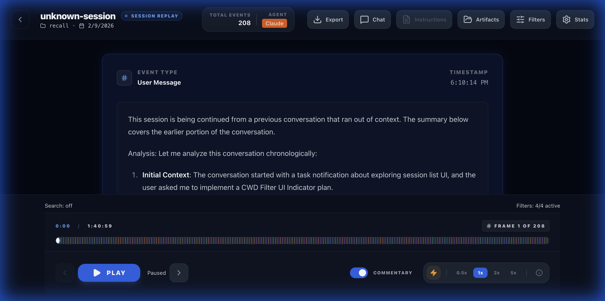
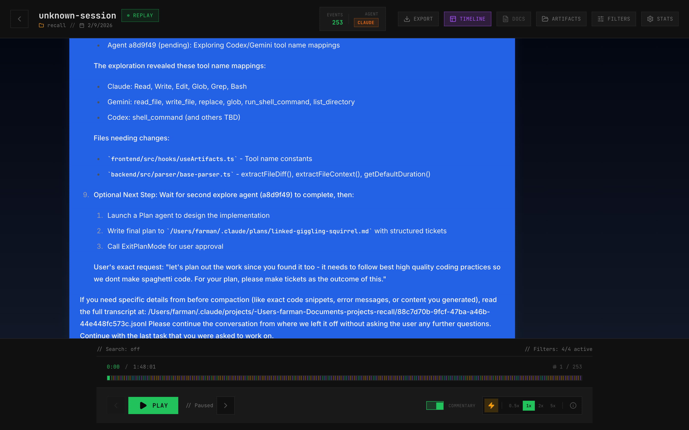
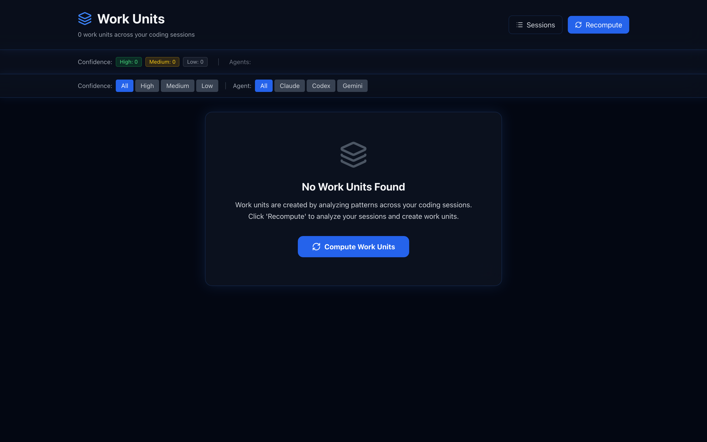

<div align="center">

# 🎬 Recall v2.1.0

**The Forensic DVR for AI-Driven Development**

[](https://www.npmjs.com/package/recall-player)
[](https://github.com/farmanp/recall)
[](LICENSE)

**Watch how features were built · Analyze AI logic · Audit codebase evolution**

Recall is a high-performance, **forensic replay tool** for AI coding sessions. It treats AI coding logs as evidence, allowing you to replay history frame-by-frame with syntax-highlighted diffs, deep search, and project-based grouping.

[Quick Start](#quick-start) · [Screenshots](#forensic-evidence) · [Features](#the-forensic-toolbox) · [Documentation](#development)

</div>

---

## 🛡️ How It Works

Recall creates a **read-only intelligence layer** over your AI coding logs:

1.  **Ingest**: Automatically scans `~/.claude`, `~/.codex`, and `~/.gemini` for session data.
2.  **Index**: Builds a high-speed SQLite FTS5 index of every thought and code change.
3.  **Visualize**: Serves a React-based "DVR" interface to replay sessions with sub-second precision.
4.  **Correlate**: Groups disparate sessions into "Work Units" for a holistic view of feature evolution.

---

## The AI "Fog of War"

Ever asked **"How did the AI build this feature?"** or **"What did it change while I wasn't looking?"**

When working with AI coding assistants, you often face a loss of context:

- 😶‍🌫️ **Invisible Decisions**: Why did it choose this library over that one?
- � **Ghost Changes**: Small edits in distant files you might have missed.
- � **Knowledge Decay**: Looking back at code a week later and forgetting how the AI reached that solution.
- 🧩 **Fragmented Work**: Related work spread across a dozen disconnected sessions.

**Recall clears the fog.** It treats AI coding sessions as **evidence to be analyzed**, giving you a high-fidelity replay of every prompt, every thought, and every file write.

---

## Forensic Evidence

### Session List


_Unified forensic dashboard with deep search and agent filtering._

### Replay Player


_Frame-by-frame playback with precise timeline scrubbing and diffing._

### Conversational View


_Toggle between technical evidence and a clean chat interface for easier reading._

### Work Units


_Group related sessions into atomic work units to track complex features._

---

## Verified Evidence Sources

Recall currently supports high-fidelity ingestion from three primary agents:

<table>
<tr>
<td align="center">

<br/><b>Anthropic's Forensic Log</b>
<br/>Full support for termly-based <code>.jsonl</code> logs.
</td>
<td align="center">

<br/><b>OpenAI's Session Vault</b>
<br/>Deep parsing of CLI execution history.
</td>
<td align="center">

<br/><b>Google's Execution Trace</b>
<br/>Visualizing the Gemini terminal assistant workflow.
</td>
</tr>
</table>

## Quick Start

### Prerequisites

- **Node.js 18+** (check with `node --version`)
- At least one AI coding agent with session history:
  - Claude Code sessions in `~/.claude/projects/`
  - Codex CLI sessions in `~/.codex/sessions/`
  - Gemini CLI sessions in `~/.gemini/tmp/`

### Installation

**Option 1: npx (Recommended)**

```bash
npx recall-player
```

This will start Recall and automatically open your browser.

**Option 2: Global Install**

```bash
npm install -g recall-player
recall
```

**Option 3: Development Setup**

```bash
# Clone the repository
git clone https://github.com/farmanp/recall.git
cd recall

# Install and build
npm install
npm run build

# Start the server
npm start
```

### Using Recall

1. Recall will automatically open your browser to http://localhost:3001
2. You'll see a list of all your AI coding sessions
3. Use the filter tabs (All, Claude, Codex, Gemini) to filter by agent
4. Click on any session to open the replay player
5. Use the playback controls to step through the session

---

---

## The Forensic Toolbox

### 📹 Mission Control (Playback)

- **Frame-by-Frame Precision**: Replay sessions at variable speeds (0.5x to 20x).
- **Timeline Forensics**: Scrubber with event density markers and chapter navigation.
- **Dead Air Compression**: Skip through long AI "thinking time" automatically.
- **Keyboard Mastery**: Full navigation via hotkeys (Space, 1-5, Arrows, Home/End).

### 🔍 Intelligence (Session Browser)

- **Multi-Agent Support**: Native parsing for **Claude Code**, **Codex**, and **Gemini**.
- **Deep Search**: Full-text search across all transcripts powered by SQLite FTS5.
- **Context Awareness**: Auto-filter sessions based on your current project directory (CWD).
- **Smart Metadata**: View model types, event counts, and first message previews at a glance.

### 📦 Logistics (Work Units)

- **Evolution Tracking**: Group fragmented sessions into a single "Work Unit" for a feature.
- **Atomic History**: Replay the entire history of a bug fix or architectural change.

### 🔒 Operational Security (Privacy)

- **Zero Cloud**: 100% local. Your code and sessions never leave your disk.
- **Forensic Logs**: Read-only ingestion. Recall never modifies your original session files.
- **Forensic Aesthetic**: High-contrast terminal design with JetBrains Mono.

---

## Use Cases

### 📚 Learning & Knowledge Sharing

**"Show the team how I implemented OAuth"**  
Record and replay your Claude Code session to demonstrate architectural decisions, debugging steps, and final implementation.

### 🐛 Debugging What Went Wrong

**"When did this bug get introduced?"**  
Scrub through timeline to find the exact moment a file change caused unexpected behavior.

### 📊 Session Analytics

**"How much time did I spend on this feature?"**  
Review session duration, frame counts, and tool executions to understand productivity patterns.

### 🔄 Resuming Interrupted Work

**"What was I working on yesterday?"**  
Quickly review your last session's work to pick up where you left off.

---

## Configuration

### Environment Variables

#### `RECALL_FILTER_CWD`

Controls automatic directory-based session filtering (default: `true`).

```bash
# Show only sessions from current directory (default)
cd /Users/me/projects/myapp
npx recall-player

# Disable filtering to see ALL sessions
RECALL_FILTER_CWD=false npx recall-player
```

#### `RECALL_EXCLUDE_PATTERNS`

Comma-separated glob patterns to exclude directories from session scanning.

```bash
# Exclude specific directories
RECALL_EXCLUDE_PATTERNS="archived,thedotmack" npx recall-player

# Exclude with glob patterns
RECALL_EXCLUDE_PATTERNS="**/test-data/**,**/plugins/**" npx recall-player
```

---

## Project Structure

```
recall/
├── backend/                 # Node.js + Express + TypeScript
│   ├── src/
│   │   ├── parser/          # Agent-specific parsers
│   │   │   ├── agent-detector.ts    # Detects agent from file path
│   │   │   ├── base-parser.ts       # Abstract parser base class
│   │   │   ├── claude-parser.ts     # Claude Code parser
│   │   │   ├── codex-parser.ts      # Codex CLI parser
│   │   │   ├── gemini-parser.ts     # Gemini CLI parser
│   │   │   └── parser-factory.ts    # Parser selection factory
│   │   ├── routes/          # API endpoints
│   │   ├── db/              # Database layer
│   │   └── types/           # TypeScript types
│   └── package.json
│
├── frontend/                # React + Vite + TypeScript
│   ├── src/
│   │   ├── pages/           # Main pages (SessionList, SessionPlayer)
│   │   ├── components/      # Reusable components
│   │   ├── api/             # API client
│   │   └── types/           # TypeScript types
│   └── package.json
│
└── README.md
```

---

## API Reference

### List Sessions

```bash
# Get all sessions
curl 'http://localhost:3001/api/sessions'

# Filter by agent
curl 'http://localhost:3001/api/sessions?agent=claude'
curl 'http://localhost:3001/api/sessions?agent=codex'
curl 'http://localhost:3001/api/sessions?agent=gemini'

# Pagination
curl 'http://localhost:3001/api/sessions?limit=10&offset=20'
```

### Get Available Agents

```bash
curl 'http://localhost:3001/api/agents'
# Returns: { "agents": ["claude", "codex", "gemini"], "counts": {...} }
```

### Get Session Details

```bash
curl 'http://localhost:3001/api/sessions/{sessionId}'
```

### Get Session Frames

```bash
curl 'http://localhost:3001/api/sessions/{sessionId}/frames'
```

---

## Keyboard Shortcuts (Session Player)

| Key            | Action                     |
| -------------- | -------------------------- |
| `Space`        | Play/Pause                 |
| `←` / `→`      | Previous/Next frame        |
| `Home` / `End` | First/Last frame           |
| `n` / `p`      | Next/Previous search match |
| `?`            | Toggle help panel          |

---

## Development

### Quick Development Setup

```bash
git clone https://github.com/farmanp/recall.git
cd recall
npm run build    # Build everything
npm start        # Start the server
```

### Backend Development

```bash
cd backend
npm run dev      # Development with hot reload
npm run build    # Build for production
npm start        # Run production build
npm test         # Run tests
```

### Frontend Development

```bash
cd frontend
npm run dev      # Development with hot reload (with API proxy)
npm run build    # Build for production
npm run lint     # Run ESLint
npm run preview  # Preview production build
```

### Publishing

```bash
npm run build              # Build backend + frontend
npm publish --access public --otp=CODE  # Publish to npm
```

---

## Session File Locations

Recall automatically scans these directories for sessions:

| Agent       | Directory                       | File Format                   |
| ----------- | ------------------------------- | ----------------------------- |
| Claude Code | `~/.claude/projects/{project}/` | `*.jsonl`                     |
| Codex CLI   | `~/.codex/sessions/`            | `*.jsonl` (with date subdirs) |
| Gemini CLI  | `~/.gemini/tmp/{hash}/chats/`   | `session-*.json`              |

---

## FAQ

### How do I capture screenshots for GitHub/docs?

We provide an automated screenshot script:

```bash
# 1. Install Playwright (if needed)
npm install -D playwright

# 2. Start Recall
npm start

# 3. In another terminal, run the script
node scripts/capture-screenshots.js
```

Screenshots will be saved to `docs/assets/`.

### Can I export or share sessions?

Currently, Recall is **view-only** and designed for local use. Sessions contain potentially sensitive code and credentials, so we don't support exporting or cloud sync. You can:

- Take screenshots of specific frames
- Use screen recording software to capture playback
- Share the session `.jsonl` files manually (with caution)

### Why isn't my agent showing up?

Recall scans these directories automatically:

- Claude Code: `~/.claude/projects/`
- Codex CLI: `~/.codex/sessions/`
- Gemini CLI: `~/.gemini/tmp/`

If you don't see sessions:

1. Verify you have session files in one of these directories
2. Check the backend logs for parsing errors
3. Try: `curl http://localhost:3001/api/agents` to see detected agents

### Can I filter sessions by project?

Yes! Use the **CWD filter** feature:

```bash
# Run Recall from your project directory
cd /Users/me/projects/myapp
npx recall-player
```

Only sessions from `/Users/me/projects/myapp` will be shown. Disable with `RECALL_FILTER_CWD=false`.

### Does Recall modify my session files?

**No.** All session files are opened in **read-only mode**. Recall never writes to or modifies your original `.jsonl` or `.json` files.

### Is my data sent to the cloud?

**Absolutely not.** Recall is 100% local-first with:

- No analytics
- No external API calls
- No telemetry
- No cloud storage

All data stays on your machine.

---

## Troubleshooting

For detailed troubleshooting, see the [**Troubleshooting Guide**](docs/TROUBLESHOOTING.md).

### Quick Fixes

**Sessions not appearing?**

```bash
# Clear the database cache and restart
rm -f ~/.recall-player/transcripts.db*
npx recall-player
```

**SQLite corruption errors?**

```bash
# The transcript DB is just a cache - safe to delete
rm -f ~/.recall-player/transcripts.db*
npx recall-player
```

**Stale npx cache?**

```bash
npx clear-npx-cache && npx recall-player
```

See the [full troubleshooting guide](docs/TROUBLESHOOTING.md) for more solutions

---

## Security Notes

- **Local-only**: This app is designed for local use only
- **Read-only**: Session files are read but never modified
- **Sensitive data**: Session files may contain API keys, credentials, or sensitive code - do not expose this app to the internet

---

## License

MIT

---

## Credits

Built with:

- [Node.js](https://nodejs.org/) + [Express](https://expressjs.com/)
- [React](https://react.dev/) + [Vite](https://vitejs.dev/)
- [TypeScript](https://www.typescriptlang.org/)
- [Tailwind CSS](https://tailwindcss.com/)

---

## 🚀 Decryption Roadmap

- [ ] **Agent Decoders**: Support for GitHub Copilot CLI and Aider.
- [ ] **Live Monitoring**: Real-time "Forensic Stream" as the AI types.
- [ ] **Annotation Mode**: Export "Annotated Evidence" with team comments.
- [ ] **Collaborative Units**: Share Work Unit files for team code reviews.

## 🤝 Community & Support

- **Bugs & Features**: Open a [GitHub Issue](https://github.com/farmanp/recall/issues)
- **Discussions**: Join the conversation on [GitHub Discussions](https://github.com/farmanp/recall/discussions)
- **Code of Conduct**: Please follow our [Community Protocol](CODE_OF_CONDUCT.md)
- **Support**: If you find Recall useful, please [star the repository](https://github.com/farmanp/recall) to show your support!

---

<div align="center">
Built with ❤️ for the AI-Augmented Developer
</div>
